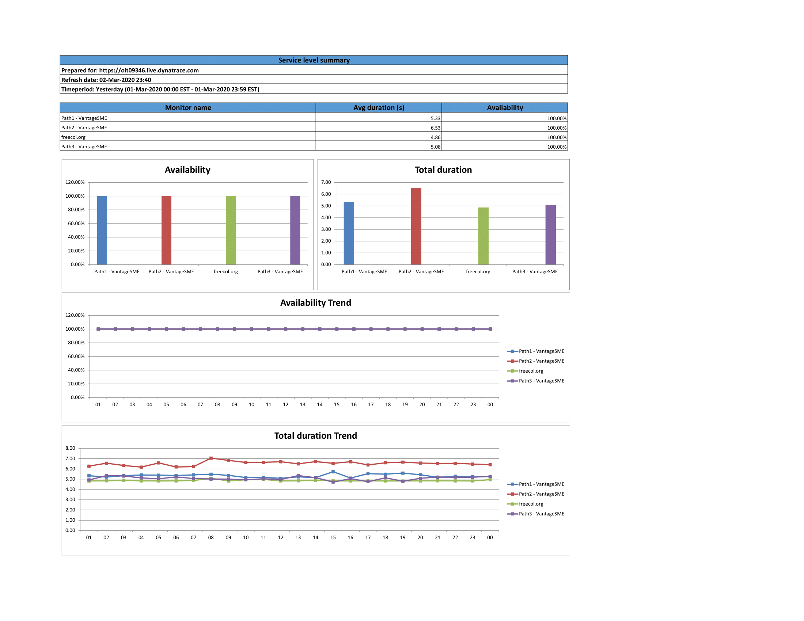
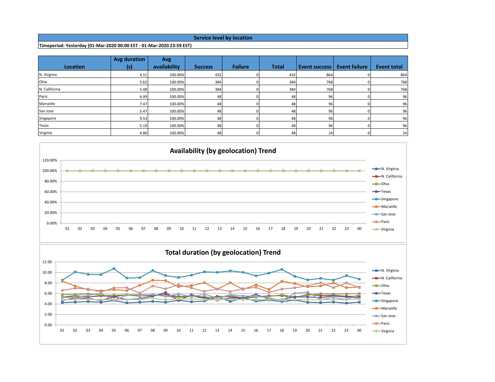
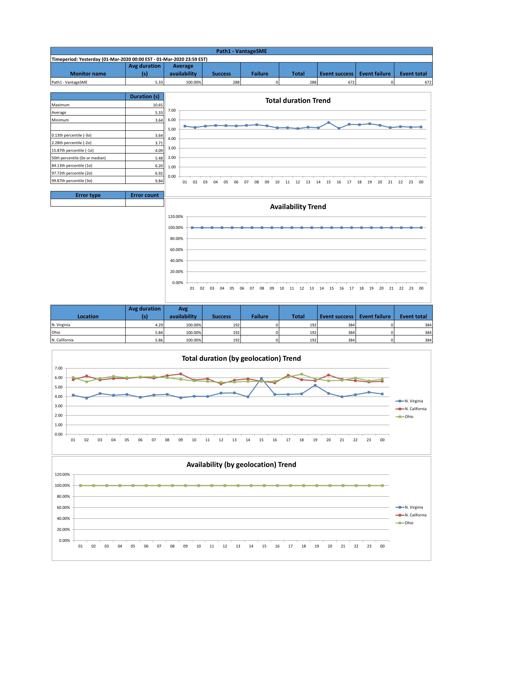
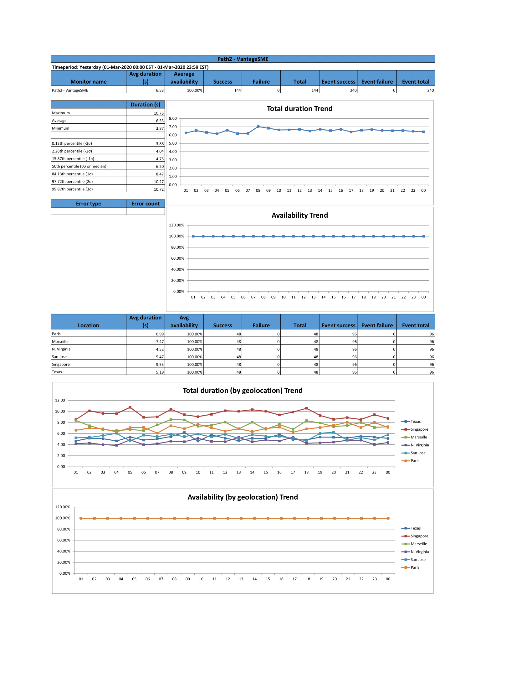
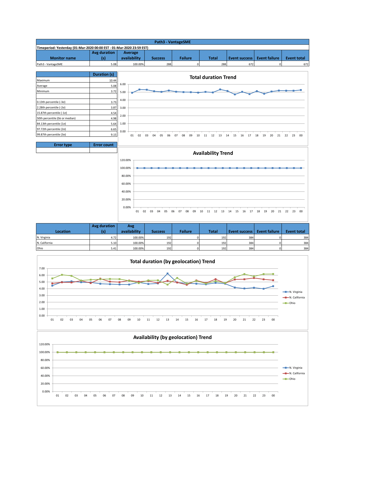

# Service_Level_Summary

This python script generates an Excel spreadsheet via the Dynatrace REST API for synthetic monitors.

Note: This script is community driven and is not officially supported through Dynatrace. For any questions or issues, please reach out to CSM-PE@dynatrace.com. 

## Getting Started

## Prerequisites

* Dynatrace tenant/environment
* [Python3.6+](https://www.python.org/downloads/)
    * [Requests HTTP library for Python](http://docs.python-requests.org/)
    * [XlsxWriter](https://xlsxwriter.readthedocs.io/)
    * [pytz](http://pytz.sourceforge.net/)
    * [tzlocal](https://github.com/regebro/tzlocal)
    * [tqdm](https://tqdm.github.io/)

## Installation
This is a python script for python 3.6+ and requires several libraries.  The best practice is to create a python Virtual Environment to execute the script.

To install:
* Install or have access to python 3.6+ installation 
* Make a directory to host the python Virtual Environment [virt_dir]
* Execute 'python -m venv virt_dir' to create the Virtual Environment (see https://docs.python.org/3/tutorial/venv.html for more detail)
* Activate the environment,  execute 'virt_dir\Scripts\activate.bat' or 'source virt_dir/bin/activate'

Now the libraries can be installed using pip. Since this is a Virtual Environment (Isolated) no other instances of python will be disturbed.

* Run the following commands
    * pip install requests
    * pip install xlsxwriter
    * pip install pytz
    * pip install tzlocal
    * pip install tqdm

This ensures that the libraries installed meet the configuration of your system.  This completes the environment setup.

Use the path virt_dir\Scripts\python.exe or virt_dir/bin/python as the path to python used to run the script.

__Use this as the python_path__

## Configuration

The config directory holds the configuration file. 

__Note: The first run of the script will create a blank config.ini file in the config directory.__

### The Config File
#### [report]

time_zone - set to desired report time zone, common timezones are listed in the common_timezones.txt file, 
if blank report will be generated using the local timezone.

prepared_for - shows on the report if blank the tenant will be used.

file_ident - set to true to have a unique identifier will be added to the end of the report file name.

#### [credentials]
The tenant and api tokens for api access.

Note: The Api-Token needs to have access scopes

* Access problem and event feed, metrics, and topology
* Read synthetic monitors, locations, and nodes
* Read configuration

proxy - set if a proxy is needed to connect to the Dynatrace APIs

#### [email_config]
Settings for email configuration

* email_server --> smtp server
* email_port --> smtp server port
* email_server_username --> smtp server username if authentication needed
* email_server_password --> smtp server password if authentication needed
* email_from --> email of where report email is from

## Usage
The script takes three command line variables:
* --tag --> tag of the monitors to be reported, if not specified all monitors are selected
* --date_option --> set to one of the following, if not specified the default is Yesterday:
    * Yesterday
    * WeekToDate
    * MonthToDate
    * LastMonth
    * LastWeek
    * Last24Hours
    * Last7Days
    * Last30Days
    * Quarter2Date
    * LastQuarter
* --notification --> the name of an email notification that holds the email lists from the Dynatrace Portal, if not specified no email will be sent

Sample command line:

python_path Service_Level_Summary.py --tag "reportTag" --date_option "LastMonth" --notification "reportNotification"

## Samle View

## Details
This script makes calls to the /api/v2/metrics,/api/v2/metrics/query with the following selectors:

* builtin:synthetic.browser.(totalDuration,success,failure):names
* builtin:synthetic.browser.(totalDuration,success,failure):names
* builtin:synthetic.browser.totalDuration:(min,max,avg):names
* builtin:synthetic.browser.errorCodes:parents:names
* builtin:synthetic.browser.totalDuration:percentile(0.13):names
* builtin:synthetic.browser.totalDuration:percentile(2.28):names
* builtin:synthetic.browser.totalDuration:percentile(15.87):names
* builtin:synthetic.browser.totalDuration:percentile(50.0):names
* builtin:synthetic.browser.totalDuration:percentile(84.13):names
* builtin:synthetic.browser.totalDuration:percentile(97.72):names
* builtin:synthetic.browser.totalDuration:percentile(99.87):names
* builtin:synthetic.browser.(totalDuration,success,failure).geo:names
* builtin:synthetic.browser.(totalDuration,success,failure).geo:names
* builtin:synthetic.browser.event.(success,failure).geo:parents:names

This script also calls /api/v1/synthetic/monitors/ for each monitor selected.

Reference: https://www.dynatrace.com/support/help/extend-dynatrace/dynatrace-api/

