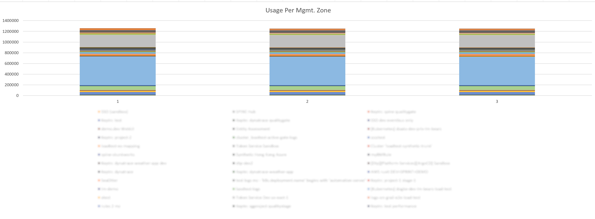

# Get Usage per Management Zone

With this script you can get an overview of the usage for each management zone per day.

Note: Default metric used is full_stack_monitoring (to use another one change METRIC_NAME in code line 3).

Possible metrics: 
```bash
builtin:billing.full_stack_monitoring.usage_per_host

builtin:billing.infrastructure_monitoring.usage_per_host

builtin:billing.runtime_vulnerability_analytics.usage_per_host

builtin:billing.runtime_application_protection.usage_per_host
```
## Usage
```bash
python usagePerMz.py   URL_TO_ENVIRONMENT   FROM_DATE_AND_TIME   TO_DATE_AND_TIME   API_TOKEN
```

## Example
```bash
python .\usagePerMz.py https://test.dev.dynatracelabs.com 2023-07-30T00:00:00Z 2023-07-30T00:00:00Z <API TOKEN>
```

## Output

```
output.csv
```



## Prerequisites

### Install modules

```
pip3 install requests
pip3 install tqdm
```

### API key
In order to use the Dynatrace API, you need an API key for your Dynatrace tenant. You can generate a key by following these steps:

1. Go to your Dynatrace environment: https://{tenant}.live.dynatrace.com.
2. Expand the side-bar menu on the left side of the screen and go to **Settings** and then **Integration**.
3. Choose the **Dynatrace API** section.
4. Click on **Generate token** to create a new API key.
5. Enter a description label and additionally set the **Read Configuration**, **Read entities using API V2** and **Read metrics using API V2** permissions. Then submit the request.
6. Expand the created key via clicking on the "Edit"-label, copy the token and use it in your Dynatrace API examples.


## Necessary parameters

**URL_TO_ENVIRONMENT**: For example https://test.dev.dynatracelabs.com

**FROM_DATE_AND_TIME**: Human-readable format of YYYY-MM-DDTHH:MM:SS (for example: 2023-07-30T00:00:00Z).
Always clamped to a full day.

**TO_DATE_AND_TIME**: Human-readable format of YYYY-MM-DDTHH:MM:SS (for example: 2023-07-30T00:00:00Z).
Always clamped to a full day.

**API_TOKEN**: Replace with your own, to create one see [API key](#API-key)
