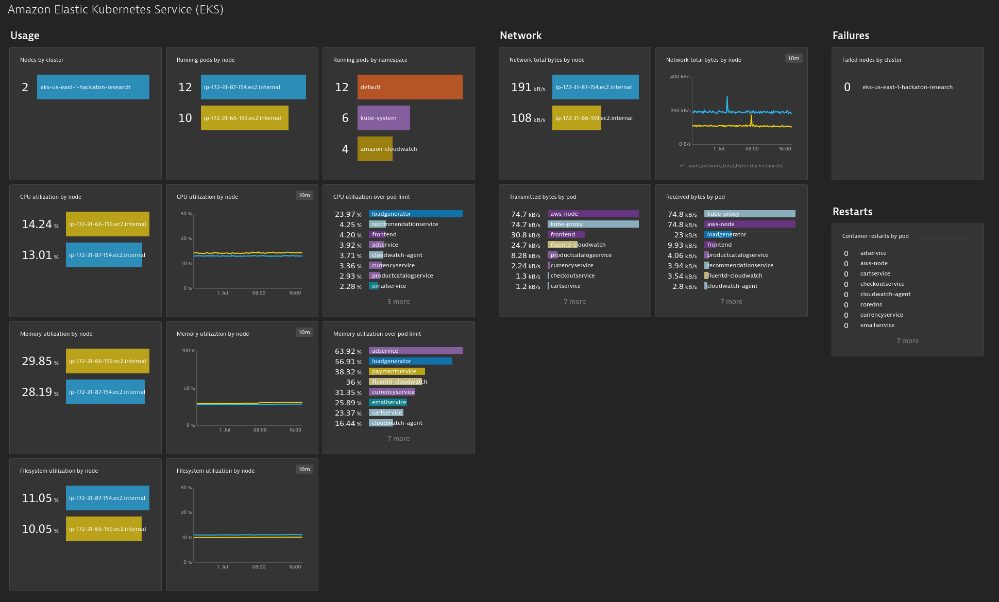
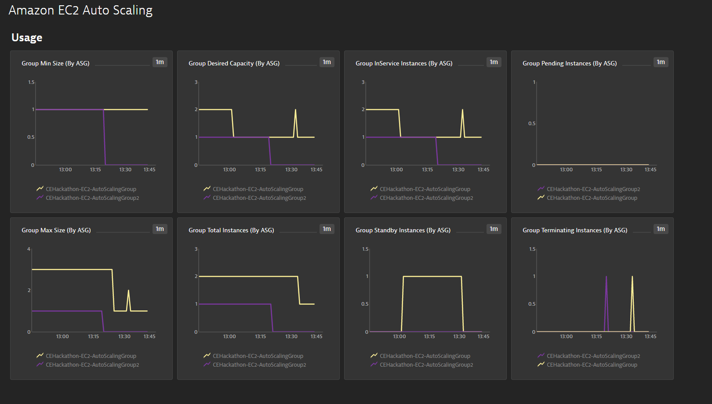
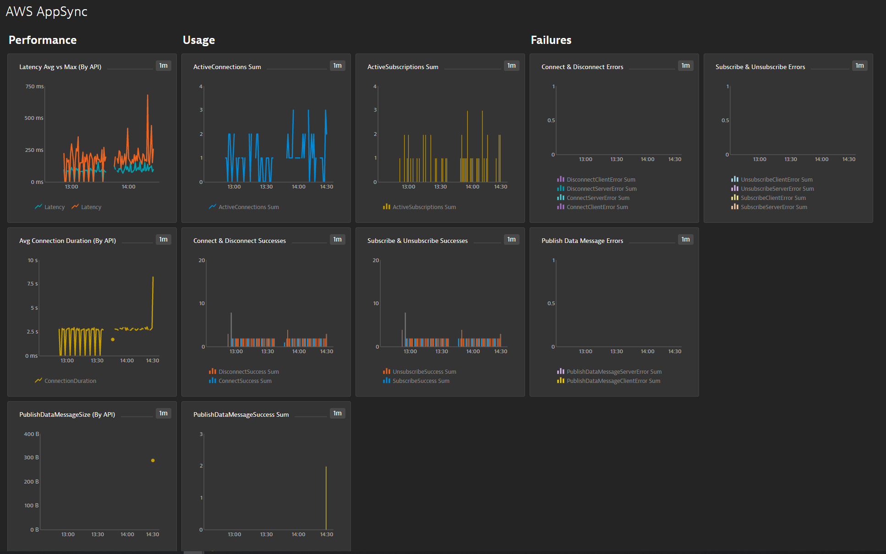
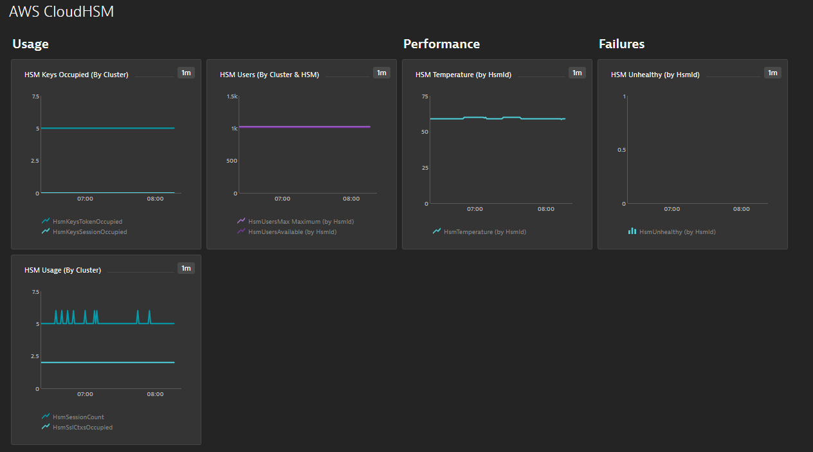
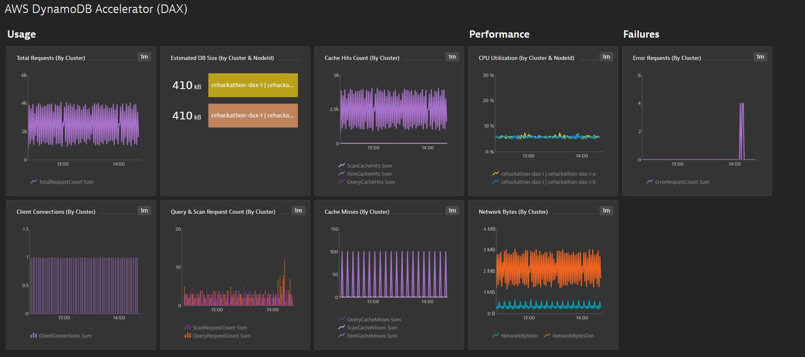
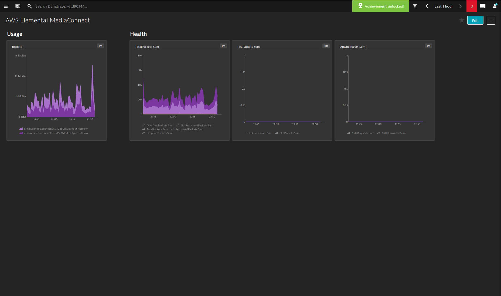
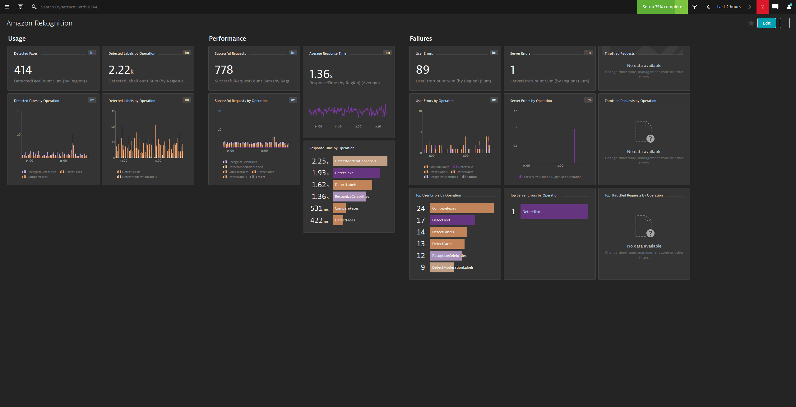

# AWS Supporting Services Dashboards

This repository contains custom dashboards for AWS Supporting Services. 

## How to use

To use AWS Supporting Services Dashboards, you have to upload them via Dashboards API. First you need to create the API token as described in [Dynatrace API - Authentication](https://www.dynatrace.com/support/help/dynatrace-api/basics/dynatrace-api-authentication/). Uploading the dashboard requires `Write configuration` permission, you have to check it when creating the token.

Example cURL command to upload the dashboard:

```shell script
curl --location --request POST 'http://{DYNATRACE_HOST}/e/{DYNATRACE_TENANT}/api/config/v1/dashboards' \
--header 'Authorization: Api-Token {TOKEN}' \
--header 'Content-Type: application/json' \
--data-binary '{PATH_TO_DASHBOARD}'
```

See [Dashboards API - POST a dashboard](https://www.dynatrace.com/support/help/dynatrace-api/configuration-api/dashboards-api/post-dashboard/#expand-540authentication) to for further details/API changes. 

## How to setup Management Zone

Some dashboards require you to set up the management zone, you can find the instruction of how to create Management Zone in [Set up management zones](https://www.dynatrace.com/support/help/how-to-use-dynatrace/management-zones/set-up-management-zones/).
The rules should be created to match relevant entities. Dashboards which require Management Zone have description of required rules setup. 

See [Dashboard timeframe and management zone](https://www.dynatrace.com/support/help/how-to-use-dynatrace/dashboards-and-charts/dashboards/dashboard-timeframe/?new-selector%3C-%3Eold-selector=new-selector) article to learn how to select management zone for imported dashboard.

## Dashboards

### [Amazon Elastic Kubernetes Service](AmazonElasticKubernetesService.json)


### [Amazon Elastic Transcoder](AmazonElasticTranscoder.json)


### [Amazon EventBridge](AmazonEventBridge.json)


### [Amazon Polly](AmazonPolly.json)


### [Amazon QLDB](AmazonQLDB.json)


### [AWS RoboMaker](AWSRoboMaker.json)


### [AWS VPN](AWSVPN.json)


### [Amazon Connect](AmazonConnect.json)

### [Amazon EC2 Auto Scaling](AmazonEC2AutoScaling.json)


### [AmazonFSx](AmazonFSx.json)


### [Amazon Transfer](AmazonTransfer.json)


### [Amazon WAF](AmazonWAF.json)


### [AWS App Sync](AWSAppSync.json)


### [AWS Cloud HSM](AWSCloudHSM.json)


### [AWS Dax](AWSDax.json)


### [AWS DMS](AWSDMS.json)


### [AWS Elastic Inference](AWSElasticInference.json)


### [AWS Media Connect](AWSMediaConnect.json)


### [AWS Media Tailor](AWSMediaTailor.json)


### [AWS Neptune](AWSNeptune.json)


### [AWS Rekognition](AWSRekognition.json)


### [AWS Step Functions](AWSStepFunctions.json)


### [AWS Storage Gateway](AWSStorageGateway.json)


### [AWS Work Mail](AWSWorkMail.json)


### [AWS Work Spaces](AWSWorkSpaces.json)
