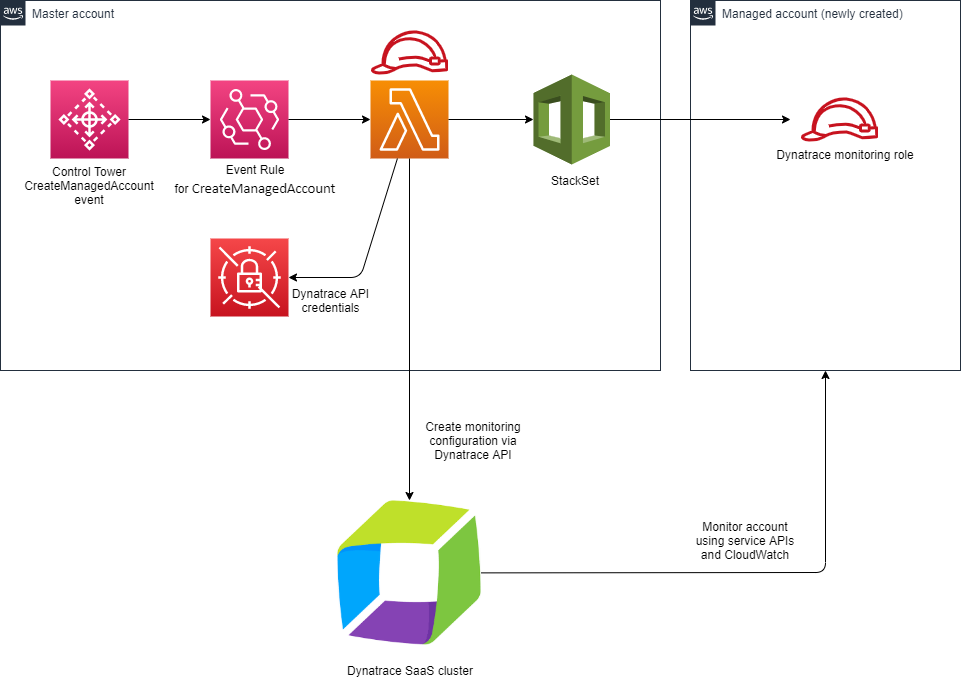

# Automatically monitor newly created accounts with Dynatrace via Control Tower integration 

The Dynatrace monitor automatic provisioning is simplifying onboarding of new AWS accounts into Dynatrace monitoring. You have your new AWS account monitored by your Dynatrace tenant in minutes after creating it, and without any need for configuration. Solution is currently compatible with Dynatrace SaaS tenants that are using Dynatrace infrastructure for monitoring (no Environment ActiveGate for AWS monitoring deployed) 

After deplying solutions following resources are added to Control Tower Master Account: 
- StackSet for creating IAM Dynatrace monitoring role in managed accounts 
- Event Rule for capturing CreateManagedAccount Control Tower event 
- Lambda that handles CreateManagedAccount event – creates StackSet instance and configure AWS monitoring settings in Dynatrace via API 
- Secret (in Secrets Manager) to store Dynatrace API url and token

Solution is triggered by Control Tower event (CreateManagedAccount). This event is created by Control Tower when creating new Managed Account. 

Solution will automatically create IAM role for Dynatrace monitoring in Managed Account and trigger Dynatrace configuration API call to configure monitoring.

Configuration: 
- Log into the Dynatrace web UI 
- Generate API Token (Settings > Integration > Dynatrace API). Token needs to have API v1 “Read configuration” and “Write configuration” permissions. 
- Download the CloudFormation template code from here 
- Login in to MASTER account in AWS Control Tower as  user with AdministratorAccess and deploy the solution –  create CloudFormation Stack using downloaded template. 
- Specify template parameters:  
  * DynatraceUrl - URL to Dynatrace tenant endpoint, e.g. https://abc12345.live.dynatrace.com 
  * DynatraceApiKey – the token that was created in step 2.2 
- Verify that stack was created successfully  

