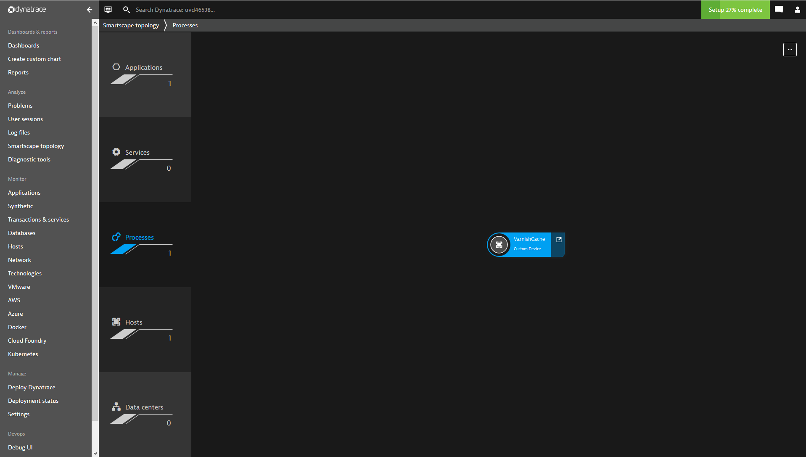
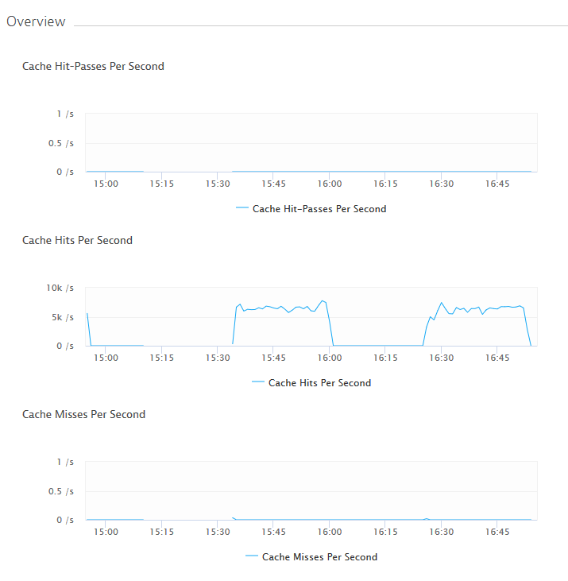

# Monitor Varnish Cache 

[Varnish Cache](https://varnish-cache.org/) is an HTTP accelerator that’s designed for dynamic, content-heavy web sites as well as heavily-consumed APIs. 

Following guide explains how to push varnish cache server metrics from [varnishstat]([varnishstat](https://varnish-cache.org/docs/trunk/reference/varnishstat.html):) into [Dynatrace](https://www.dynatrace.com).

## How-To Guide
### Generate an API Token
The first thing to do is to generate an API token with the appropriate permissions. To register and report custom metrics, you need the Access problem and event feed, metrics, topology and RUM JavaScript tag management permission assigned to your API token.
See the [Dynatrace Help on API authentcation](https://www.dynatrace.com/support/help/extend-dynatrace/dynatrace-api/basics/dynatrace-api-authentication/) to learn how to obtain and use it.

### Register Custom Metrics
Before metric data can be send to a custom device, it is necessary to register the desired custom metrics with a PUT request as described at [Dynatrace help on custom metrics](https://www.dynatrace.com/support/help/shortlink/api-custom-metrics).

The timeseriesIdentifier parameter of the PUT request has to match the following format:
* for absolute values: **custom:<metric_name>**
* for per-second values: **custom:<metric_name>.per_second**

where **<metric_name>** is the field name of a metric as reported by **varnishstat**:

``` 
./varnishstat -l
Varnishstat -f option fields:
Field name                     Description
----------                     -----------
MAIN.uptime                    Child process uptime
MAIN.sess_conn                 Sessions accepted
MAIN.sess_drop                 Sessions dropped
MAIN.sess_fail                 Session accept failures
MAIN.client_req_400            Client requests received, subject to 400 errors
MAIN.client_req_417            Client requests received, subject to 417 errors
MAIN.client_req                Good client requests received
MAIN.cache_hit                 Cache hits
MAIN.cache_hitpass             Cache hits for pass
MAIN.cache_miss                Cache misses
...
``` 
So, for example, valid metric names would be **MAIN.cache_hit, MAIN.cache_hitpass, and MAIN.cache_miss**.

Therefore, you can use the following request to register the MAIN.cache_hit metric
``` 
curl -X PUT "https://{base-url}/timeseries/custom:MAIN.cache_hit" \
-H "Authorization: Api-Token <your API token>" \
-H "Content-Type: application/json" \
-d '{
	"displayName" : "Cache Hits",
	"unit" : "Count",
	"types": [
		"Varnish Cache"
	]
}'
``` 
or to register the corresponding per-second metric MAIN.cache_hit.per_second, the following request would be necessary
``` 
curl -X PUT "https://{base-url}/timeseries/custom:MAIN.cache_hit.per_second" \
-H "Authorization: Api-Token <your API token>" \
-H "Content-Type: application/json" \
-d '{
	"displayName" : "Cache Hits Per Second",
	"unit" : "PerSecond",
	"types": [
		"Varnish Cache"
	]
}'
``` 
The **base-url** can be found under "Settings">"Integration">"Dynatrace API">"Dynatrace API Explorer" below the title ("Dynatrace Environment API").

### Report Custom Metrics Via varnish_metrics.py
The python script **varnish_metrics.py** is an example demonstrating the usage of the Varnish API to extract metrics values and Dynatrace API to feed them into your monitoring environment. Feel free to adapt it as needed.
The script reports the metrics to the server via the Dynatrace API as described at [Report custom device metric via REST API](https://www.dynatrace.com/support/help/shortlink/api-custom-device-report-metric).

#### Prerequisites
* [python 3](https://www.python.org/downloads/)
* The [Requests](http://docs.python-requests.org/en/latest/) python library

#### Script Usage

``` 
usage: varnish_metrics.py [-h] [-a AGGREGATION] [-e VARNISHSTAT_EXE]
						  [-i INTERVAL] [-s]
						  base_url api_token custom_device_id fields
						  [fields ...]

Reports specified varnish metrics periodically to the Dynatrace server.


positional arguments:
  base_url              The base URL of the Dynatrace environment.
  api_token             An appropriate API token.
  custom_device_id      The ID of the custom device.
  fields                The field inclusion glob used for varnishstat to
						select the desired metrics.

optional arguments:
  -h, --help            show this help message and exit
  -a AGGREGATION, --aggregation AGGREGATION
						Specifies how many metric values of one metric are
						aggregated in an API request (default 6).
  -e VARNISHSTAT_EXE, --varnishstat-exe VARNISHSTAT_EXE
						The path to the varnishstat executable (default
						'/usr/bin/varnishstat').
  -i INTERVAL, --interval INTERVAL
						The interval in seconds in which the metrics are
						gathered from varnishstat (default 10s).
  -s, --per-second      Specifies if the metrics should be reported as per-
						second values, e.g. cache hits per second (default
						false).
``` 

##### Positional Arguments
The **base_url** and **api_token** arguments are the same as used to (register the custom metrics)[#Register-Custom-Metrics].

The **custom_device_id** argument specifies the ID of the custom device endpoint to which the metrics are sent. This is either the ID of an existing custom device (if a custom device was created explicitly as described at [Create custom device via Dynatrace API](https://www.dynatrace.com/support/help/shortlink/api-custom-device-create) or some arbitrary ID (e.g. "VarnishCache") for which a custom device will be created automatically.

The **fields** argument, which can have multiple values, specifies the metrics to be captured. This argument takes the same values as the **-f** option of varnishstat. For example, **./bin/varnishstat -f "MAIN.cache*" -j** yields:
``` 
{
  "timestamp": "2019-04-10T18:32:04",
  "MAIN.cache_hit": {
	"description": "Cache hits",
	"type": "MAIN", "flag": "c", "format": "i",
	"value": 0
  },
  "MAIN.cache_hitpass": {
	"description": "Cache hits for pass",
	"type": "MAIN", "flag": "c", "format": "i",
	"value": 0
  },
  "MAIN.cache_miss": {
	"description": "Cache misses",
	"type": "MAIN", "flag": "c", "format": "i",
	"value": 0
  }
}
``` 
Therefore, using the string MAIN.cache* as the fields value would report metrics for MAIN.cache_hit, MAIN.cache_hitpass, and MAIN.cache_miss (or MAIN.cache_hit.per_second, MAIN.cache_hitpass.per_second, and MAIN.cache_miss.per_second if the **--per-second** option is specified).

##### Optional Arguments
The **a** or **-aggregation** option determines how many metric values of one metric (e.g. MAIN.cache_hit) are reported per API request to the server. This value defaults to 6.

The **e** or **-varnishstat-exe** option specifies the path to the varnishstat executable. The default value is /usr/bin/varnishstat.

The **i** or **-interval** option specifies the interval (in seconds) in which the script calls varnishstat to gather metric values. This value defaults to 10 second.

The **s** or **-per-second** option causes the metrics to be reported as per-second values (e.g. MAIN.cache_hit.per_second for cache hits per second). This option is disabled by default so that by default the absolute values of the metrics, as reported by varnishstat, are sent.

## Example
Invoking the script with
``` 
./varnish_metrics.py "base-url" "api-token" "VarnishCache" "MAIN.cache*" --per-second
``` 
creates a custom device called "VarnishCache" that is shown under "Processes" 


The script gathers metric values each INTERVAL x 1s (default 10s) and aggregates AGGREGATION (default 6) of them to one message. Therefore, each INTERVAL x AGGREGATION x 1s (default 60s) a message containing AGGREGATION (default 6) metric values is sent to the server.

The charts displaying the reported metrics can be seen after clicking on the custom device:


## License
This project is licensed under [Apache 2.0 license](LICENSE).